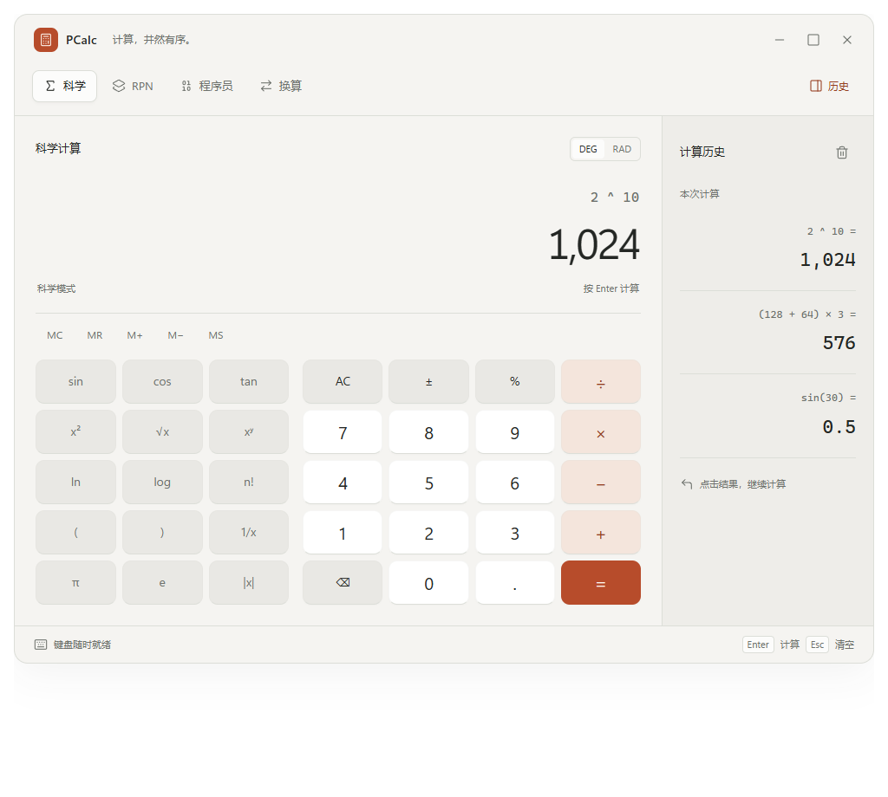
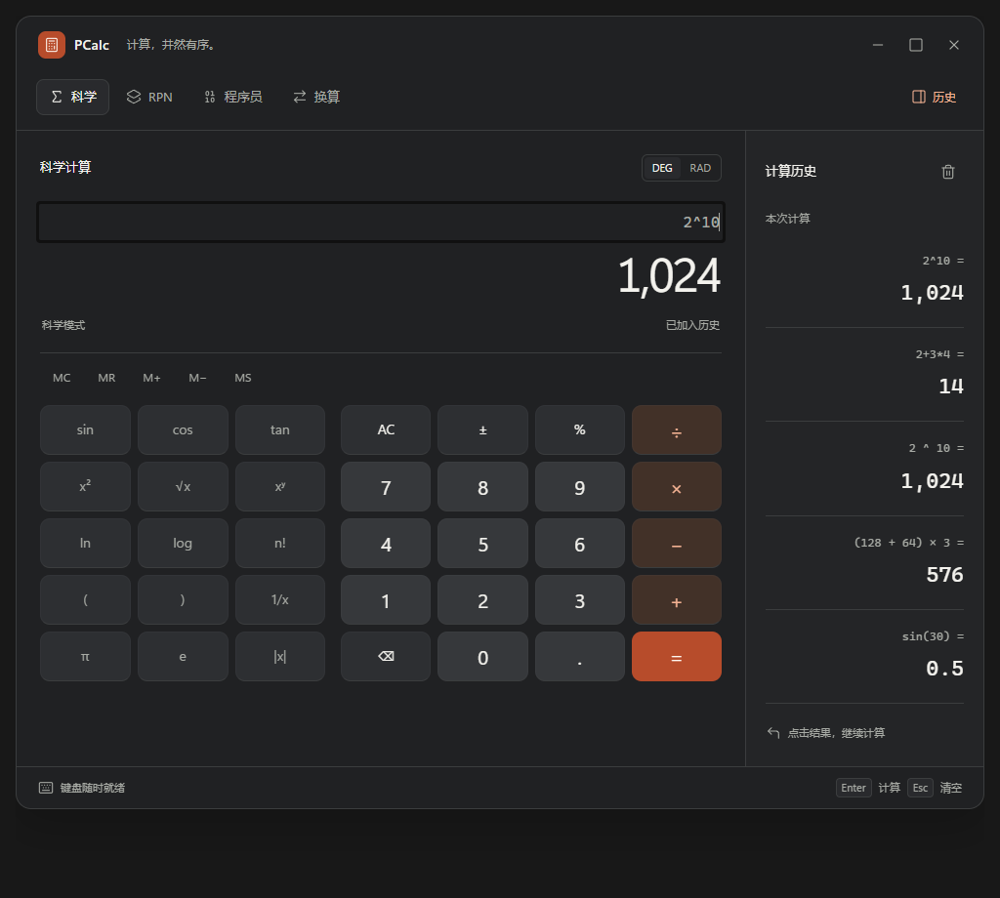

# PCalc UI 改版开发实施文档

版本：1.0 · 日期：2026-09-15 · 技术栈：Free Pascal 3.2.2 / Lazarus / LCL / Win64。

本文把本次交互预览与此前审计建议转成开发任务。适合按章节逐步修改当前项目，目标是形成布局清晰、视觉统一、键盘可用、行为可靠的专业桌面计算器。

**状态说明：这是开发规范，应用尚未按此改版。** 文中的“新增类型”“新增方法”和“建议文件”均为待实现设计，不是项目已经具备的 API。尺寸为建议初值，需通过原生窗体实测校准。浏览器预览只提供视觉与交互参考，不是正式计算引擎。

配套问题证据见 [计算器项目审计与增强建议](计算器项目审计与增强建议-2026-09-15.md)。该报告中的 F01～F12 编号在本文继续使用。

## 1. 先确定改版边界

### 1.1 目标

| 维度 | 开发目标 |
| --- | --- |
| 视觉 | 统一字体、线性图标、圆角、间距与颜色；结果是第一视觉焦点 |
| 操作 | 数字键、科学函数、运算符与等号有清楚层级；历史可随时回填 |
| 原生体验 | 保留 Lazarus 原生程序，支持键盘、窗口缩放、DPI 和系统窗口管理 |
| 功能 | 保留现有完整功能集合；低频功能通过二级面板组织 |
| 稳定性 | 鼠标和键盘共用计算命令，统一异常反馈，计算值与显示文字分离 |
| 发布 | 基础正确性、UI 回归与 Release 产物检查通过后再发布 |

“商业化”在本轮指产品完成度，不自动包含收费、登录、联网、遥测或订阅系统。PCalc 名称暂作为当前项目标识沿用；对外独立发布的命名另行决定。

### 1.2 预览不能直接照搬的内容

| 预览中的简化 | 正式开发要求 |
| --- | --- |
| 程序员页面演示 32 位无符号值 | 保留 8/16/32/64 位、Signed/Unsigned、HEX/DEC/OCT/BIN、位矩阵及所有已有位运算 |
| 角度仅显示 DEG/RAD | 保留 DEG/RAD/GRAD，建议用三段切换或有文字的下拉选择 |
| 科学函数只展示 15 个常用入口 | 2nd、双曲函数、反函数、立方/立方根、nPr/nCr/MOD 等仍可访问 |
| 换算只演示长度、温度、质量 | 保留完整 10 类单位与常数库 |
| JavaScript 临时解析器、Number 和简化 RPN | 不移植为生产引擎；继续修复并调用 Pascal 引擎 |
| 历史为示例数据，最多展示少量行 | 正式版从真实计算记录生成；不预置虚构的“用户历史” |
| 顶部最小化/最大化/关闭图案 | 预览为装饰；原生版本使用真实系统标题栏与窗口命令 |
| 浏览器可编辑完整表达式 | 首期保持当前逐键输入模型；完整表达式编辑是单独功能，需解析器和状态同步支持 |
| 主题/强调色通过预览调整面板选择 | 正式版放入应用设置菜单，不引入预览宿主依赖 |
| 小屏预览把历史移到底部 | Windows 窄窗口采用可关闭工具页，避免把窗口拉成长页面 |

## 2. 视觉参考

以下为本次浏览器交互原型的截图，不是当前 EXE 的运行截图；浅色与深色图中的历史内容可能不同。字体、控件状态与边框最终以原生环境验收为准。

### 暖白主题



### 石墨黑主题



需要保留的设计特征：结果大且清晰、表达式次级呈现、数字区与函数区分组、等号承担主要强调色、历史独立成栏。窗口外部阴影和标题栏由 Windows 提供，首期不实现无边框窗体。

## 3. 页面结构与窗口适配

### 3.1 推荐控件层级

下面是建议的新控件树。名称用于开发沟通，不表示现有代码已声明这些字段。

```text
TForm1                         系统标题栏：PCalc
├─ PanelToolbar               科学 / RPN / 程序员 / 换算 | 历史 | 更多
├─ PanelWorkspace
│  ├─ PanelCalculatorHost     当前页面
│  │  ├─ PanelModeHeader      模式名 + 本模式参数
│  │  ├─ PanelDisplay         表达式、主结果、错误/存储状态
│  │  ├─ PanelModeExtra       RPN 栈 / 程序员进制与位矩阵
│  │  ├─ PanelMemory          MC / MR / MS / M+ / M− / CE
│  │  └─ PanelKeypadHost
│  │     ├─ PanelFunctions    常用科学函数 + 2nd/更多入口
│  │     └─ PanelNumberPad    数字与基础运算
│  └─ PanelHistoryHost        宽窗侧栏；窄窗切换成工具页
└─ PanelStatus                非模态状态与关键快捷键
```

换算模式使用独立 `PanelConverter` 填满主区域，隐藏不相关的计算显示和数字键盘；输入/输出卡片与单位选择在该页内部布局。历史栏可以保留，但不会改变当前计算引擎状态。

### 3.2 尺寸基准

统一用 **96 DPI 下的逻辑尺寸** 描述布局；以下宽高都是客户区尺寸，不含系统标题栏、边框和任务栏。

| 项目 | 建议值 | 说明 |
| --- | --- | --- |
| 宽屏默认客户区 | 960 × 720 | 主区约 716，历史区 244；工作区不足时先适配显示器 |
| 紧凑客户区 | 560 × 720 | 默认隐藏历史侧栏 |
| 最小客户区 | 440 × 600 | 需采用紧凑布局，不能只等比缩小所有内容 |
| 历史侧栏 | 244，最小 220 | 是否展示还取决于主区是否有足够宽度 |
| 主区内边距 | 常规 24，紧凑 16，最小 12 | 四周一致，避免零散硬编码 |
| 大区块间距 | 16 或 24 | 模式参数、显示区、键盘之间 |
| 同组按钮间距 | 8，紧凑 6 | 统一整数逻辑像素 |
| 工具栏高度 | 一行 48；需要换行时按内容增长 | 不能挤压图标与文字 |
| 结果区域高度 | 常规约 144，紧凑约 104 | 含表达式和局部错误提示 |
| 常规按键高度 | 52～56 | 最小窗口核心键盘仍建议 ≥44 |
| 按键圆角 | 10 | 导航 8，分段选择 6，外层卡片 12 |
| 状态栏高度 | 28，允许按内容增高 | 小窗口可省略静态说明，但保留错误 |

落地前需把所有区域的高度相加检查。在 600 高的客户区内，若 RPN 或位矩阵导致高度不足，应折叠低频区域、切换科学函数分页或让专用列表滚动；不要通过字号降到不可读来“塞进去”。

### 3.3 横向适配规则

令客户区逻辑宽度为 `W`：

| 条件 | 布局行为 |
| --- | --- |
| `W ≥ 900` 且用户开启历史 | 并排历史栏；仍要求主区可用宽度 ≥620 |
| `620 ≤ W < 900` | 默认只显示主区；点击历史进入工具页，返回时恢复当前模式 |
| `440 ≤ W < 620` | 紧凑工具栏；常用参数保留，辅助操作放“更多”；科学函数允许分页/折叠 |
| 工作区小于最小尺寸要求 | 优先可滚动的低频工具区域与紧凑模式，窗口不得移出屏幕；明确平台验收边界 |

侧栏出现/消失的判断要预留约 16 逻辑像素滞回空间，避免拖动窗口时反复跳变。记录“用户希望显示历史”和“当前空间允许显示侧栏”两个不同状态。

显示器缩放为 200% 时，960 逻辑宽度可能超出实际工作区。启动前根据当前显示器可用客户区选择紧凑尺寸，不能强制创建 960 宽窗。

### 3.4 键盘网格计算

科学主键盘使用左侧函数三列、右侧数字四列，各自排成五行；函数区域的 2nd/更多在上方独立工具条内，不改变数字键位置。

```text
函数区（3 列）         数字区（4 列）
sin  cos  tan          AC   ±   %   ÷
x²   √x   xʸ           7   8   9   ×
ln   log  n!           4   5   6   −
(    )    1/x          1   2   3   +
π    e    |x|          ⌫   0   .   =
```

MC/MR/MS/M+/M−/CE 独立成行。`CE` 不混同 `AC`；支持 Delete 清除当前输入。即使更多科学功能面板打开，数字键位置尽量不变。

布局公式应从容器可用空间计算，而不是逐个手调：

```text
UsableWidth = ContainerClientWidth - PaddingLeft - PaddingRight
ColumnWidth = floor((UsableWidth - (ColumnCount - 1) * Gap) / ColumnCount)
X(c) = PaddingLeft + c * (ColumnWidth + Gap)
```

余数像素分配给前几列或最后一列，保证末列不越界。纵向同理。`ColumnWidth` 小于设定最小值时切换布局档位，不能返回旧布局并留下过期控件尺寸。

## 4. 配色与字体规范

### 4.1 颜色 Token

以暖白、石墨黑作为第一轮验收主题。浅黄主题保留兼容，但不要把黄色应用到所有控件；后续沿同一 Token 体系调校。HEX 均为常规 `#RRGGBB`。

| 语义 Token | 暖白 | 石墨黑 | 使用位置 |
| --- | --- | --- | --- |
| WindowBg | `#F5F4F1` | `#202123` | 窗体、主工作区 |
| Surface | `#FCFCFB` | `#292A2D` | 导航选中项、输入卡片 |
| HistoryBg | `#EEEDE9` | `#242527` | 历史栏 |
| NumberBg | `#FFFFFF` | `#36383B` | 数字键 |
| FunctionBg | `#E9E8E4` | `#2D2F32` | 科学函数、低权重工具键 |
| TextPrimary | `#242724` | `#F3F2ED` | 主结果、数字与重要标签 |
| TextSecondary | **`#626660`** | `#A8ABA5` | 函数文字、表达式、帮助文字 |
| Border | `#DCDED8` | `#3B3D3E` | 结构分隔、控件边界 |
| Accent | `#B74C2B` | `#B74C2B` | 等号、少量品牌标识 |
| OnAccent | `#FFF8F2` | `#FFF8F2` | 强调按钮文字 |
| AccentSoft | `#F4E5DC` | `#423128` | 运算符背景 |
| AccentText | `#963D21` | `#F5B394` | 运算符文字、少量强调文字 |

**规范对预览做了一项可读性修正：** 预览浅色次级文字为 `#6D716C`，放在 `#E9E8E4` 上约为 4.05:1；正式规范改为 `#626660`，约为 4.77:1。石墨黑函数文字约为 5.77:1，默认等号前景/背景约为 4.89:1。这些是基于静态色值的计算，不是所有状态的完整验收。

普通文字建议以 ≥4.5:1 为验收基准，大文字按适用条件至少 ≥3:1；hover、pressed、disabled 与 focus 需逐项检查。标准解释及审计背景参见配套报告。

可选强调色：松石绿 `#246451`、专业蓝 `#315EC6`。切换时要同时切换 Accent、OnAccent、AccentSoft、AccentText，不允许只改一个十六进制值；每套组合单独复核对比度。

### 4.2 与现有 `TThemePalette` 的对应

| 现有字段 | 修改方向 |
| --- | --- |
| `BgColor` | 对应 WindowBg |
| `TabBg` | 普通页面跟随 WindowBg；历史单独增加 HistoryBg，避免混用 |
| `DisplayBg/DisplayText/DisplaySubText` | 显示区随主题对应 WindowBg/TextPrimary/TextSecondary |
| `NumBtnBg/NumBtnText` | NumberBg/TextPrimary |
| `FuncBtnBg/FuncBtnText` | FunctionBg/TextSecondary |
| `OpBtnBg/OpBtnText` | AccentSoft/AccentText |
| `EqualBtnBg/EqualBtnText` | Accent/OnAccent |
| `TopBtnActiveBg/TopBtnActiveText` | Surface/TextPrimary；用边框、字重辅助区分选中 |
| 新增建议 | HistoryBg、FocusRing、ErrorText/ErrorBg、DisabledText、各类边框颜色 |

当前 `uThemeManager.pas` 注释和实现把显示屏颜色固定为黑底白字。采用新方案时应同时更新这一约定及 README，不留一处旧逻辑把白色主题的显示区重新强制染黑。

Pascal 中通过 `RGBToColor(R,G,B)` 创建颜色。不要直接把 `#RRGGBB` 写成 `TColor($RRGGBB)`，避免颜色通道顺序错误。

### 4.3 字体

| 元素 | 96 DPI 下视觉目标 | Pascal 参考字号 | 字重 |
| --- | --- | --- | --- |
| 主结果 | 44～54 px；窄窗 ≥32 px | 33～40.5 pt；窄窗 ≥24 pt | 常规 |
| 输入表达式 | 16 px | 12 pt | 常规 |
| 数字键 | 20～22 px | 15～16.5 pt | 常规或适度加重 |
| 科学函数 | 14 px | 10.5 pt，可按控件能力取 11 pt | 常规 |
| 导航/正文 | 13～14 px | 10～11 pt | 选中项加重 |
| 辅助标签 | 12 px 左右 | 9 pt | 常规 |

上表为视觉换算参考，不要求 LCL 的整数 `Font.Size` 接受小数。优先使用 `Segoe UI`，中文回退到 `Microsoft YaHei UI`；等宽数值/进制使用 `Consolas`，可选 `Cascadia Code` 但不可要求用户安装。

取消 `RefreshTheme` 和按钮构造器里“所有按钮强制粗体”的策略。主结果尽量保持稳定字号；过长时切换科学计数法、提供完整复制或滚动查看，不持续缩小到难以阅读。

### 4.4 图标与窗口外观

模式与工具图标采用同一线性风格，基准 16/20 px；不要混用 emoji、不同粗细的符号和系统图标。图标按钮必须有可访问名称、焦点状态和可发现的文字说明。

预览使用 Lucide 风格图标。正式版可选择一套许可清楚的本地图标资源，记录来源与许可；按 DPI 缓存多个尺寸，在本地绘制。首期保留文字标签作为资源加载失败的回退，不依赖在线 CDN 或系统彩色 emoji 字体。

保留原生标题栏、拖动区、最小化、最大化、关闭、Alt+F4、系统菜单和窗口贴靠能力。圆角或暗色标题栏 API 不可用时回退标准系统外观，不阻止启动。

## 5. 自绘按钮改造

修改入口：`uCalcButton.pas` 中的 `TCalcButton.Create`、`Paint`、鼠标事件、`SetColors`；主题映射位于 `unit1.pas` 的 `RefreshTheme`。

### 5.1 新增语义角色

当前主题通过 `Caption='='`、`Caption='×'` 等字符串识别按钮用途，改字或本地化后容易失效。建议增加独立角色与命令类型。

```pascal
{ 新增设计示例；需整合到对应 unit 的声明区 }
type
  TCalcButtonRole = (
    cbrNumber, cbrFunction, cbrOperator, cbrPrimary,
    cbrNavigation, cbrUtility, cbrBit
  );

  TCalcAction = (
    caDigit, caDecimal, caBinary, caUnary, caEquals,
    caClearAll, caClearEntry, caBackspace,
    caMemory, caSwitchMode, caRecallValue
  );

  TCalcCommand = record
    Action: TCalcAction;
    Argument: string;  { 数字、运算符、函数或内存命令 ID }
  end;
```

按钮显示文本、图标、主题角色和执行命令分别配置。例如“×”是显示文本，`caBinary / multiply` 是稳定命令。不要依赖 Caption、控件坐标或当前文字来猜测计算操作。

### 5.2 状态绘制规则

| 状态 | 视觉与行为 |
| --- | --- |
| Normal | 按角色应用 Token，按钮四周无残留旧背景 |
| Hover | 轻微变化背景或边框，不改变文字尺寸；需保持对比度 |
| Pressed | 可向下偏移 1 个逻辑像素，不修改控件实际布局 |
| Selected | 用于模式、角度制、字长、位值；独立于鼠标按下状态 |
| Focused | 绘制清楚的焦点环；可与 Selected 同时出现 |
| Disabled | 明确不可操作，鼠标和键盘都不触发命令 |

禁用状态优先；按下背景优先于普通 hover，焦点环最后绘制。圆角绘制前先填充整个 `ClientRect` 的正确底色，避免当前 `csOpaque` 配合只画 RoundRect 留下角落旧像素。

当前 `CornerRadius` 直接传入圆角绘图参数。修改时核对绘图库接收的是椭圆直径还是半径；Token 使用“视觉半径”，底层转换集中处理。

### 5.3 键盘和鼠标

- 按钮提供 TabStop、明确 TabOrder、Space/Enter 激活及可见焦点。Space 在松开时执行一次，长按不应触发重复命令，除非该命令明确支持重复。
- 保留原生 `Click` 事件链。不要在 `MouseUp` 中再额外调用一次 Click 而造成双触发。
- 拖出按钮再松开不执行；鼠标捕获丢失、窗口失焦和 Enabled 改变后，Pressed 状态必须复位。
- 容器不得吞掉已经属于按钮的 Enter。窗体“等号”快捷键与按钮激活只能执行其中一次。
- TabStop 不能代替读屏支持。需要验证按钮角色、名称、禁用与选中状态是否能被 Narrator 获取；必要时优先采用原生按钮能力或补充平台可访问性实现。

首期可直接切换状态色，不强制实现动画。增加动画时控制在约 80～120 ms，并提供减少动态效果的回退。

## 6. 各模式开发要求

### 6.1 科学计算

现有入口：`BuildScientificTab`、`LayoutScientificTab`、`OnAlg*`。

1. 把现有 `FScientificRows[0..6]` 拆成“内存条、函数区、数字区”三套布局数据，取消按一张 7 列网格组织所有功能。
2. 常用函数使用第 3.4 节布局。2nd 改变三角/反三角等成对功能时保持按键位置稳定，并让选中状态明显。
3. 双曲函数、立方/立方根、nPr/nCr/MOD 等放“更多函数”面板，按类别展示。可用键盘打开、操作并返回。
4. 显示区分为表达式、当前结果、局部状态三行。内存标记预留独立位置，不能与表达式重叠。
5. 完整表达式编辑暂列第二阶段。首期保留只读结果与逐键输入；不得只是把 `ReadOnly` 改为 False 就声称支持表达式编辑。

### 6.2 RPN

现有入口：`BuildRPNTab`、`LayoutRPNTab`、`UpdateRPNStackLabels`、`OnRPN*`。

X 是主结果，Y/Z/T 在紧凑栈面板中显示；若同时显示四级，避免让 X 与主显示产生不同数值。保留 ENTER、DROP、SWAP、Roll Up/Down、CLEAR、Clear X。ENTER 作为主要动作可使用强调色，其它栈操作保持次级样式。

数据来自 `TRPNEngine`，UI 不维护第二套数值栈。先修复 F03：ENTER 后输入覆盖复制出的 X，计算完成后开始新数字按已定义的 stack-lift 规则提升。验收序列至少包括 `3 ENTER 4 + 5 × → 35`。

### 6.3 程序员

现有入口：`BuildProgrammerTab`、`LayoutProgrammerTab`、`UpdateProgrammerBasesAndBits`、`OnProg*`。

| 区域 | 要求 |
| --- | --- |
| 模式参数 | 进制、字长、Signed/Unsigned 按组布局；窄窗换行，不重叠 |
| 数值 | 四进制来自同一 QWord/有符号解释；显示格式变化不能改数值 |
| HEX 输入 | A～F 只在 HEX 可输入；其它进制明确禁用，不只靠点击后忽略 |
| 位矩阵 | 显示所选字长；高位组明确编号；8 位时高于第 7 位不可操作 |
| 长 BIN | 分组显示、换行或可横向查看；不可依赖 AutoSize 把标签撑出窗口 |
| 算术规则 | Signed 除法/余数、字长回绕、输入溢出、逻辑/算术右移各自说明 |
| 精度 | 64 位整数始终走整数类型，不能经 Double、FormatDisplayFloat 或科学结果文本往返 |

AND/OR/XOR/MOD 是接收第二个操作数的命令。移位支持原有位数输入；不能将预览的“一位移位”或示例参数固化成全部能力。

### 6.4 单位换算与常数

现有入口：`BuildConverterTab`、`LayoutConverterTab`、`OnConv*`、`OnInsertConstantClick`。

- 上方选择类别；源值和结果用两块独立区域，单位选择附在对应区域右侧；交换按钮明确为“交换单位”。
- 推荐规则：交换仅交换单位并重新计算，保留源输入数值。如果后续需要“把结果作为新输入”，提供不同的命令与文案，避免两个行为混用。
- 保留全部类别；窄窗可使用下拉选择。常用类别可快捷显示，不能隐藏剩余类别。
- `EditFromVal` 保留原生选择、退格、Delete、粘贴、方向键和小数输入。控件正在编辑时窗体快捷键让行。
- `''`、`'-'`、`'1e-'` 属于输入过程，显示空结果/等待，不弹窗。完全非法文本显示局部错误，不转成 0。
- 温度、数据单位、Mach 等文案与物理假设沿用审计要求。单位换算不经过全局微小值清零函数。
- 常数库单独列表展示名称、符号、数值、单位；明确目标计算模式。双击与“代入”按钮调用同一命令。

### 6.5 历史

现有入口：`BuildTapeTab`、`LayoutTapeTab`、`AppendToTape`、`OnTapeUseClick`。

历史是辅助工具，不再是与科学/RPN/程序员互相覆盖的计算模式。第一阶段可保留 `cmTape` 兼容，但调用新侧栏不能把有效引擎模式改为 `cmTape`。

建议新增两个状态：`FLastCalculationMode`（仅代数/RPN/程序员）和 `FHistoryRequested`（用户是否希望打开历史）。换算页单独记录工具页状态，不把它当成常数代入的引擎。

| 交互 | 明确规则 |
| --- | --- |
| 单击历史条目 | 选中；显示可用操作，不意外替换正在输入的表达式 |
| 双击或“回填” | 默认将该记录送回其原计算模式，并显示目标模式；调用引擎的“接收外部值”入口 |
| 发送到其它模式 | 显式动作，检查数值类型/字长与精度；必要时提示转换损失 |
| 有未完成表达式时回填 | 首期只替换当前操作数，保留已有 Token；需有对应引擎 API 和回归测试 |
| RPN 回填 | 遵循同一外部值/stack-lift 规则；不通过改字符串后盲目 Enter |
| 复制 | 单行/全部，支持复制“显示值”和“完整精度值” |
| 清空 | 可撤销或短暂提供恢复入口；范围仅为应用内历史 |

单击只选中是相对预览“单击即回填”的正式交互调整：桌面用户可以先检查记录，双击/按钮再执行。若最终选择保留单击即回填，必须提供撤销并修改验收规范，不能两种行为随机并存。

历史模型建议使用带类型的数值，至少保存：ID、时间、完整表达式、原模式、角度制、字长/符号/进制、错误状态、数值原值、显示字符串。浮点和 QWord 分别存储，不能只存 Double。

为数字精度设置两个边界：计算记录保留引擎原值；复制/导出按明确格式转换。不要解析 `"[时间] 表达式 = 结果"` 这样的展示字符串恢复计算数据。

## 7. 状态机与统一命令入口

这部分是 UI 改版的功能基础。现有按钮和键盘直接分别调用引擎，导致错误反馈与操作顺序不一致。

### 7.1 建议调用流程

```text
按钮/快捷键/历史/常数
    → TCalcCommand
    → DispatchCommand（统一入口）
    → 校验当前模式、参数和允许动作
    → 调用对应引擎
    → 生成成功/失败结果对象
    → 同步显示模型；成功时写结构化历史
    → 更新发生变化的控件
```

上述 DispatchCommand 为建议新增方法。UI 绘制过程不执行运算；主题切换、Resize、进入历史都不修改引擎。

### 7.2 输入状态

建议把单一 `FIsNewInput` 拆成明确状态及独立的“下一位数字是否替换当前输入”标志：

| 状态 | 下一步规则 |
| --- | --- |
| EditingNumber | 数字继续追加；小数点与长度有校验 |
| OperandReady | 一元函数、MR、常数或回填已经形成有效操作数；后续运算符必须消费它 |
| AwaitingOperand | 刚输入二元运算符；可替换运算符或开始下一操作数 |
| Evaluated | 数字开始新计算；运算符从原始数值结果继续；重复等号按产品规则 |
| Error | 显示明确错误；AC/CE/修正输入有可预测的恢复方式 |

状态名是设计示例，RPN 还需要独立的 stack-lift 标志。所有模式切换不得暗中把当前值重置成预览中的 255 或 1024。

### 7.3 错误反馈

错误建议分为 InvalidInput、DomainError、DivideByZero、Overflow、TooComplex、InternalError。普通计算错误在显示区呈现简短文案；内部错误记录诊断信息并提供恢复方式，不泄露整段堆栈到正常操作界面。

`1 ÷ 0 =` 应明确显示“不能除以零”，且不写入成功历史；再次等号不重复抛异常。显示文本、错误状态、可继续运算的数值必须一致，禁止屏幕看似为 0 但内部实际错误。

## 8. DPI、重绘与资源管理

### 8.1 DPI 缩放

集中定义逻辑尺寸，所有布局档位都从逻辑基准重算。可使用如下纯整数辅助函数：

```pascal
{ 设计示例：适用于非负逻辑尺寸；Ppi 来自实际窗体当前 DPI }
function ScaleMetric(const LogicalValue, Ppi: Integer): Integer;
begin
  Result := Integer((Int64(LogicalValue) * Ppi + 48) div 96);
end;
```

逻辑尺寸不应被反复覆盖成物理像素。LCL 自动缩放与手工布局需要明确责任：LCL 负责窗体/字体的自动 DPI 生命周期；自定义布局每次用基准尺寸和当前 DPI 重新设置 Bounds。不要把已经自动缩放过的 Bounds 再乘一次比例。

普通 `Font.Size` 按点数配置一次，避免在每次 Resize 中重复随窗口高度放大字号。自绘图标、描边与圆角按当前 DPI 取资源或计算。DPI 改变通知的实际接入方式以本机 LCL 版本 API 为准，先验证再接入。

### 8.2 重绘

- 在创建/批量调整控件时使用布局批处理，保证 try/finally 恢复；避免每改一个 Bounds 就触发完整布局。
- Color、Caption、Selected、Enabled 等实际变化时才 Invalidate。
- 优先重绘可见模式；主题切换可以更新全局 Token，但不必重新创建整棵控件树。
- Paint 内禁止访问磁盘、构造字体资源、创建网络对象或进行计算。画笔、字体和图标资源明确所有权，释放与复用可验证。
- Token/历史容量有上限；列表按可见项绘制。已有历史是正常数据增长，不能把全部增长都当内存泄漏，也不能忽略无限增长。
- 表达式显示采用增量更新或合并刷新，避免每个按键都重新格式化全部 Token。

## 9. 文件与方法改造清单

源码入口已按本轮工作区检查。下面采用方法名定位；后续行号变化时以图谱或方法定义为准，不修改 `backup/` 和 `lib/` 中的副本。

| 文件 | 现有入口 | 具体任务 |
| --- | --- | --- |
| `uCalcTypes.pas` | 模式、角度、字长、主题枚举 | 增加按钮角色/命令与独立工具页状态；保留原有枚举的兼容语义 |
| `uThemeManager.pas` | `TThemePalette`、`GetThemePalette` | 引入语义 Token；暖白/石墨黑配色；显示区随主题；分离强调色 |
| `uCalcButton.pas` | `Create`、`Paint`、鼠标事件 | 非全粗体、完整背景绘制、角色、图标、焦点/键盘和捕获取消 |
| `unit1.pas` | `BuildTopBar/LayoutTopBar` | 模式导航和工具入口分组；窄窗处理；历史不覆盖计算模式 |
| `unit1.pas` | `BuildDisplayArea/LayoutDisplayArea` | 表达式/结果/状态分区；数值与显示分离；取消字号无限随高度增长 |
| `unit1.pas` | `BuildScientificTab/LayoutScientificTab` | 拆分内存、函数、数字网格；高级功能入口与功能盘点 |
| `unit1.pas` | `BuildRPNTab/LayoutRPNTab` | 栈面板与主结果统一，保留全部堆栈操作 |
| `unit1.pas` | `BuildProgrammerTab/LayoutProgrammerTab` | 参数分组、BIN 换行、字长位矩阵与无效按键禁用 |
| `unit1.pas` | `BuildConverterTab/LayoutConverterTab` | 两张输入/输出卡片、交换、完整类别及常数入口 |
| `unit1.pas` | `SetMode/RefreshTheme/UpdateDisplays` | 页面切换、主题、数据刷新解耦；删除按 Caption 判角色逻辑 |
| `unit1.pas` | `FormKeyDown/FormKeyPress` | 编辑控件优先，快捷键命令化；保证 Enter 只执行一次 |
| `unit1.pas` | `AppendToTape/OnTapeUseClick/OnInsertConstantClick` | 完整记录、类型化回填、明确目标模式和原子更新 |
| `unit1.lfm` | 主窗体属性 | 与代码统一最小尺寸、字体、事件绑定；避免两处配置互相覆盖 |
| `project1.lpi/.lpr` | 构建、DPI、资源 | 新 unit 纳入项目；Debug/Release；验证 DPI 与原生窗口行为 |
| `test_calc.lpr/test_gui_calc.lpr` | 断言与退出码 | 更新测试定位方式；失败必须非零；补新的状态与可访问性检查 |

建议新增文件按需要逐步引入，不为拆分而一次性迁移所有代码：

| 建议文件 | 职责 |
| --- | --- |
| `uLayoutMetrics.pas` | 逻辑尺寸 Token、布局档位与缩放帮助函数 |
| `uCalcCommands.pas` | 命令定义与分发适配；不依赖具体 Caption |
| `uHistoryModel.pas` | 带类型的历史数据、上限、回填与导出数据模型 |
| `uAppSettings.pas` | 主题偏好、窗口位置、历史显示偏好等设置 |
| `uIconResources.pas` | 本地图标索引与 DPI 缓存 |

设置文件需校验、缺省与损坏回退，采用稳定字符串 ID，而不是把 enum Ord 当永久存储协议。历史持久化与主题偏好分开：记住主题不等于默认保存全部用户计算记录。

## 10. 与审计缺陷的依赖关系

| 审计项 | UI 改版前/期间必须完成的修复 | 验收例子 |
| --- | --- | --- |
| F01 | 取消通用微小值清零 | `1 eV → J` 保持 `1.602176634e-19` |
| F02 | 一元/MR/常数成为有效操作数 | `2 + √9 + 4 = 9` |
| F03 | RPN stack-lift | `3 ENTER 4 + 5 × = 35` |
| F04/F05 | Signed 运算与零位旋转 | 8 位 `-8/2=-4`；`0x81 RoL 0=0x81` |
| F06 | 排列组合范围与整数转换 | 大 n 不变负数；可表示的组合数不因 Round(Int64) 报错 |
| F07 | 换算键盘与非法输入 | 可输入 `12.5`、退格、粘贴；`abc` 不显示零结果 |
| F08 | 同一错误入口与恢复 | 鼠标/键盘除零相同；再次等号不向外抛异常 |
| F09 | 有界三角函数范围缩减 | 超大角度在预算内返回有效结果或明确拒绝 |
| F10 | 数值和显示串分离 | `(1000000000000001 + 0) - 1000000000000000 = 1` |
| F11 | 历史/常数目标与完整记录 | 纸带含 `2 + 3 = 5`，回填后确实为 5 |
| F12 | 明确百分比、幂与溢出规则 | 推荐 `200×10%=20`；按选定规范编写测试 |

视觉开发可以先在测试窗体中进行，但以上确定性错误未修复前不要把新外观包装成稳定专业版。完整需求与数学规则以审计报告及最终确定的测试规范共同约束。

## 11. 分阶段任务列表

每阶段可以单独提交，变更应能独立编译并回归。建议按以下顺序推进。

### 阶段 A：视觉基础与组件（先获得可见改善）

- [ ] A1：整理颜色、字体、间距、圆角 Token，修改 `uThemeManager.pas`。
- [ ] A2：去掉全按钮粗体，明确 Role，重做 TCalcButton 正常/按下/选中/禁用/焦点状态。
- [ ] A3：按钮支持键盘与统一 Click；加入命令 ID，不再由 Caption 决定动作。
- [ ] A4：以科学页验证暖白/石墨黑，不立即重写所有模式。
- [ ] A5：检查功能键对比度、长标签和 100%/150%/200% 字体。

交付：可运行的科学页视觉骨架；不丢失原有计算入口。

### 阶段 B：窗体与布局

- [ ] B1：重组工具栏、主显示、内存条、函数区、数字区与状态栏。
- [ ] B2：实现宽/紧凑布局和历史容器；最小尺寸下无重叠。
- [ ] B3：处理更多函数、GRAD、CE、置顶、主题设置入口。
- [ ] B4：历史开关与计算模式分离，调整 `SetMode`。
- [ ] B5：统一 LFM 与 FormCreate 的尺寸设置，处理启动工作区边界。

交付：默认、最小、最大化三种窗口尺寸下可操作的外壳。

### 阶段 C：命令、数据和错误

- [ ] C1：鼠标、键盘、MR、常数、历史走统一分发。
- [ ] C2：修复 F01～F10，明确 F12 产品约定。
- [ ] C3：引擎原值、输入文本、格式化显示分离；程序员值保留 QWord。
- [ ] C4：结构化历史与安全回填，成功计算后记录完整表达式。
- [ ] C5：编辑控件快捷键优先；错误状态可见且可恢复。

交付：风险回归用例通过；UI 操作与引擎行为一致。

### 阶段 D：全部模式与设置

- [ ] D1：迁移 RPN、程序员、换算；完成所有旧功能的入口盘点。
- [ ] D2：接入本地图标、字体回退、Narrator 名称和角色。
- [ ] D3：主题跟随系统/手动选择与偏好保存；已有浅黄主题保留。
- [ ] D4：选配绿/蓝强调色，逐状态验证；不允许任意颜色破坏可读性。
- [ ] D5：历史限额、图标缓存、按需刷新、长表达式性能优化。

交付：功能完整的候选版本；包含待验证平台清单。

### 阶段 E：发布验收

- [ ] E1：修复测试退出码，清理只比较常量的伪测试。
- [ ] E2：完成第 12 节矩阵，保存真实 EXE 截图和数据。
- [ ] E3：Debug/Release 分离，记录版本、工具链、产物 hash 和安全加固检查。
- [ ] E4：同步 README、用户手册、快捷键与功能入口截图。

完整范围可参考审计报告的分阶段工期；不要把“改几种颜色”当作整个工作量估算。

## 12. 验收用例与发布门槛

### 12.1 必须执行的 UI 用例

| ID | 操作 | 预期 |
| --- | --- | --- |
| UI-01 | 暖白/石墨黑切换，停在科学页 | 主结果、函数、运算符、输入与边界均可读；无白块、残影 |
| UI-02 | 440×600、560×720、960×720 和最大化 | 核心键盘可用；工具栏不重叠；历史按空间规则展示 |
| UI-03 | 100%/125%/150%/200% DPI 与跨屏移动 | 字体/图标/点击区域同步缩放，返回原 DPI 不累积变大 |
| UI-04 | Tab/Shift+Tab，Space/Enter 激活 | 焦点可见，顺序合理，每次仅执行一次命令 |
| UI-05 | 鼠标按下后拖出松开，再返回 | 不触发多余 Click，按下状态不残留 |
| UI-06 | 输入 `2 + √9 + 4 =` | 结果为 9，历史表达式完整 |
| UI-07 | 科学/RPN/程序员反复切换 | 各模式状态保留，无预览值或其它模式值覆盖 |
| UI-08 | 在换算框输入/选区替换/退格/粘贴 `12.5` | 编辑行为正常；合法值换算，非法值给局部提示 |
| UI-09 | 算出 5，再输入 9，回填历史中的 5 | 目标模式明确，原始数值正确回填；未完成表达式按规定处理 |
| UI-10 | 代入物理常数、小量单位换算 | 不被清零；保留正确单位与原值 |
| UI-11 | 鼠标和键盘分别触发除零，再按等号/CE/AC | 相同错误反馈，可恢复；不进入异常弹窗循环 |
| UI-12 | 输入最大 QWord、切换 Signed/字长/进制 | 无 Double 精度损失；溢出/截断提示按规范 |
| UI-13 | RPN 连续运算与全部栈操作 | X/Y/Z/T 一致，ENTER 与运算后输入的提升规则正确 |
| UI-14 | 关闭/打开历史、窄窗进入历史再返回 | 不清空引擎，不丢未完成输入，不误改计算模式 |
| UI-15 | 系统高对比度与 Narrator | 关键按钮有名称/角色，焦点与禁用状态可感知 |
| UI-16 | 关闭再启动；设置文件损坏/屏幕配置改变 | 配置有回退，窗口处于可见工作区 |

截图至少覆盖：两主题 × 科学/RPN/程序员/换算/历史 × 默认/紧凑尺寸；再补错误、焦点、长数值、200% DPI 的代表状态。截图应来自实际编译后的原生应用。

### 12.2 功能、性能与安全门槛

| 项目 | 建议门槛 |
| --- | --- |
| 原有基础测试 | 44 个核心断言保持通过；GUI 测试必须按真实失败返回非零 |
| 已知缺陷 | 确定性风险回归全部修复；规则类断言与产品约定一致 |
| 单位往返 | 10 类 530 个单位对测试通过，并增加数量级边界 |
| 常规按键刷新 | 测试机上 p95 <50 ms；记录测量方法和样本数 |
| 模式切换 | p95 <100 ms，记录是否包含消息处理与绘制 |
| 可交互启动 | 目标 <500 ms；测从进程启动到首帧可交互，不能用 CreateForm 耗时代替 |
| 复杂输入 | 长度/深度有上限；大角度与高成本运算不无限阻塞 |
| 资源 | 重复模式/主题切换后堆、句柄、GDI 对象无持续异常增长 |
| 发布 | Release 体积、版本、hash、签名状态和 PE 加固能力可追溯 |

以上性能数字是目标，不是已达成结果。对于无法在本机完成的 DPI、系统版本或读屏验收，需要明确标记，不用浏览器原型测试替代。

### 12.3 如何复用现有审计测试

`audit/2026-09-15/build-and-test.ps1` 编译的是该目录下的 **旧源码快照**。直接执行它能复现审计问题，不能证明根目录修复生效。

修改后应把 `audit_core.lpr`、`audit_gui.lpr` 的相关用例迁入正式 `tests/`，或者创建新的日期快照，确保 `-Fu` 指向修复后的源码且 `-FU` 使用独立输出目录。GUI 改版后按钮 Caption、父子层级变化，测试应改为稳定的命令 ID/组件名定位，不能无声跳过找不到的按钮。

当前项目可用的 GUI 构建命令示例：

```powershell
& 'C:\lazarus\lazbuild.exe' --build-all '.\project1.lpi'
```

此命令会重建当前项目的生成文件。建议在自己的开发副本中运行，保留当前未提交工作。新增的 Release 模式尚未实现，文档不提供假定已存在的 Release 命令。

## 13. 最短落地路径

如果先做一轮容易检查的修改，按下面五步推进即可：

1. 修改 `uThemeManager.pas`，把数字、函数、运算符和等号分成四种视觉角色，先完成两套可读的主题。
2. 修改 `uCalcButton.pas`，去掉全粗体，统一圆角与完整背景绘制，补焦点与键盘行为。
3. 重构科学页的显示、内存、函数、数字四个区域；按最小窗口检查布局。
4. 把历史改成独立工具容器，修正回填和换算键盘；同时用统一命令入口修复计算状态错误。
5. 完成两主题、多 DPI、真实输入和全部计算回归后，再迁移其余模式并发布。

开发过程中以本文件的规范和功能保留清单为准，以参考图判断视觉方向，以审计测试验证计算行为；三者职责不同，不能互相替代。
